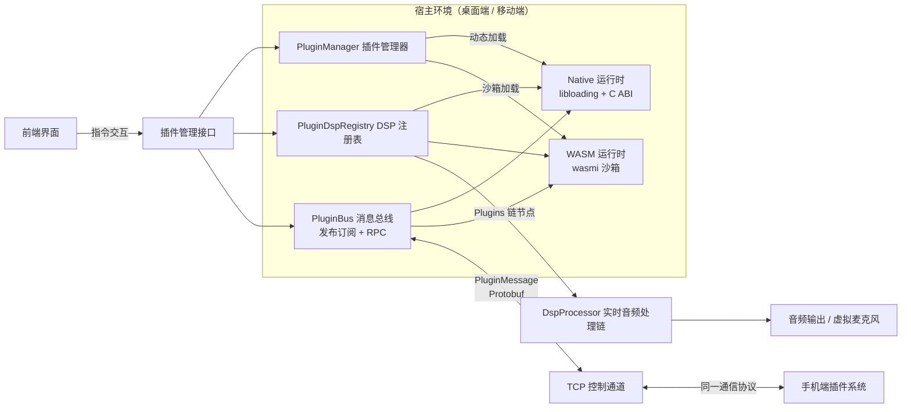
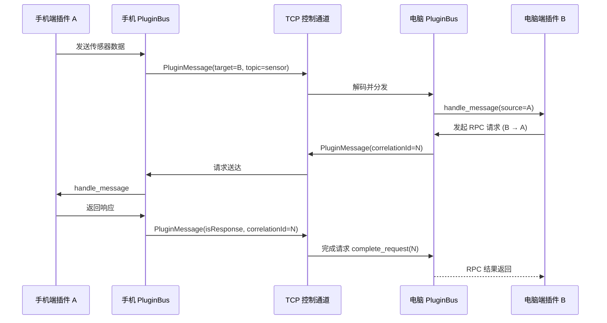

# 插件系统总览

MicYou 提供了轻量且强大的插件系统，允许开发者扩展音频处理能力（DSP 节点）、注册专属设置面板、绑定全局快捷键，以及在电脑与手机之间同步数据。

## 核心设计目标

- **双运行时架构**：支持高性能 **Native**（C ABI 动态库）与安全隔离的 **WebAssembly (WASM)** 插件，两套运行时采用统一的清单描述、权限模型与通信协议。
- **音频链深度接入**：DSP 插件可无缝插入实时音频处理管线，进行降噪、变声、均衡、音效增强等处理。
- **端到端协议对齐**：桌面端（Tauri）与移动端共享同一套 Manifest 格式、Host API 语义及 Protobuf 跨端消息总线。
- **无头与跨端解耦**：插件引擎独立于 UI 界面运行，在 GUI 桌面端、无头 CLI 及终端 TUI 模式下均可稳定工作。

## 系统架构

## 双运行时对比

| 特性 | Native 插件（cdylib） | WebAssembly 插件（WASM） |
| --- | --- | --- |
| **文件产物** | `.so` / `.dylib` / `.dll` | `.wasm` 字节码模块 |
| **加载机制** | `libloading` + 版本化 C ABI | `wasmi` 解释器（内存与指令沙箱） |
| **运行性能** | 原生最高性能，支持硬件加速与系统调用 | 解释执行，安全受控，适合常规逻辑与辅助处理 |
| **系统能力** | 完整系统权限（底层驱动、ONNX 模型、硬件访问） | 受限沙箱环境，仅能通过宿主授权的 Host API 操作 |
| **实时音频安全** | 由插件代码保证，需在清单声明 `realtimeSafe: true` | 默认尽力而为（Best-effort），禁止声明 `realtimeSafe` |
| **典型应用场景** | 实时音频 DSP、高算力算法、深度硬件整合 | 逻辑扩展、设置面板、自动化任务、音效板、轻量过滤 |
| **跨平台支持** | 需针对各操作系统分别编译产物 | 单一 `.wasm` 文件即可跨全平台通用 |

## DSP 音频链路接入机制

- **音频处理线程**：服务端的 PCM 音频流在独立的实时音频线程中运行，经由 `DspProcessor::process` 链式处理。
- **处理节点编排**：默认处理链路包含回声消除 (AEC)、降噪、去混响、均衡器 (EQ)、增益放大、自动增益 (AGC) 与语音检测 (VAD)。
- **插件节点调度**：已启用的 DSP 插件由合成节点 **`Plugins`** 统一调度，默认置于 AEC 节点之后执行（用户可在桌面设置中调整先后顺序）。
- **执行顺序保障**：插件节点的执行顺序由 `PluginDspRegistry` 确定性管理（优先执行声明了 `first` 的节点，其余按插件 ID 排序）。
- **异常安全隔离**：单个插件若在处理音频时抛出异常或超时，宿主会自动将其旁路（Bypass），确保主音频流不中断、不崩溃。

## 跨端通信模型

电脑与手机建立连接后，两端的插件可以通过统一的消息总线相互通信：

- **消息载体**：Protobuf 定义的 `PluginMessage`，挂载于底层控制通道。
- **通信模式**：支持主题发布订阅（Publish/Subscribe）、请求响应（RPC）及全网广播。
- **协议共用**：手机端与电脑端遵循相同的总线协议与消息结构。

## 插件分类

| 分类 | 核心功能 | 推荐运行时 |
| --- | --- | --- |
| **DSP / 实时音频处理** | 插入音频流水线，实时修改音频样本 | Native（WASM 仅限轻量处理） |
| **Utility / 辅助工具** | 后台自动化、网络请求、文件记录、系统通知 | WASM / Native |
| **UI / 面板组件** | 注册专属设置页或交互式控制界面 | WASM（+ iframe 桥接） |
| **Bridge / 跨端桥接** | 手机传感器数据采集、设备状态双向同步 | WASM / Native |
