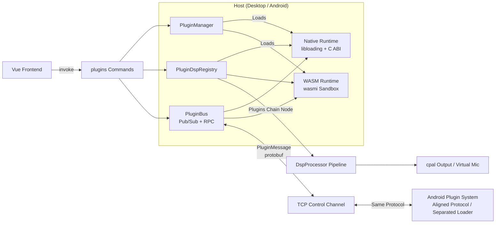
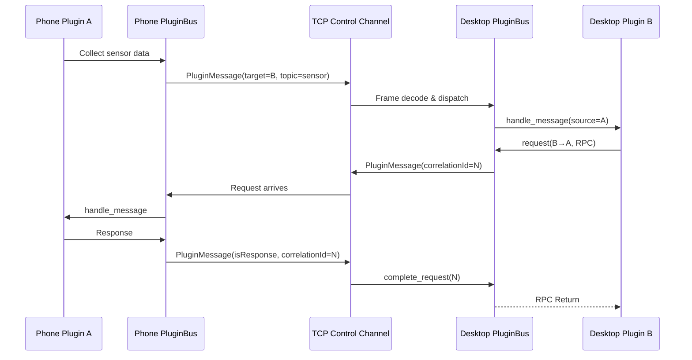

# Plugin System Overview

## Goals

- **Dual Runtimes**: **Native** (cdylib) and **WASM** plugins with unified abstraction, manifest structure, and protocol.
- **Extensible Integration**: Plugins can insert custom DSP nodes, register UI panels, subscribe to bus events, and send/receive cross-device messages.
- **Shared Contracts**: Desktop (Tauri) and future Android clients share the exact same Manifest schema, Host API capabilities, and protobuf wire protocols.
- **Headless & Decoupled**: Zero intrusive dependency on frontend GUI; shared across GUI, CLI, and TUI modes.

## Architecture

## Dual Runtimes Comparison

| Feature | Native (cdylib) | WASM |
| --- | --- | --- |
| Binary Target | `.so` / `.dylib` / `.dll` | `.wasm` module |
| Loading Mechanism | `libloading` + versioned C ABI | `wasmi` pure Rust interpreter |
| Performance | Maximum (direct hardware & system calls) | Interpreted, suitable for general logic |
| System Capabilities | Full (drivers, ONNX, raw audio devices) | None (memory sandbox + host permission gating) |
| Realtime Safety | Guaranteed by plugin, declared via `realtimeSafe` | Default best-effort, cannot declare `realtimeSafe` |
| Typical Use Cases | Real-time DSP, virtual audio drivers, deep OS hooks | Logic extensions, UI panels, automation, lightweight filters |
| Cross-Platform | Platform-specific binaries | Single portable artifact for all platforms |

## Relationship with DSP Audio Pipeline

- The core audio pipeline executes on a dedicated real-time audio thread (`crates/micyou-core/src/server/audio_pipeline.rs`). Decoded PCM is chained through `micyou_audio::DspProcessor::process`.
- The processing chain order is defined in `settings.json` under `processing_chain` (defaults to AEC, Noise Suppression, Dereverberation, EQ, Amplifier, AGC, VAD).
- Plugins hook into the audio graph through `DspProcessor::set_external_hook`, where the composite **`Plugins`** node coordinates active DSP plugins.
- By default, plugin nodes execute right after AEC (users can customize the order in GUI settings).
- Node execution order is managed deterministically by `PluginDspRegistry` (supports `first` priority flag, followed by plugin ID sorting).
- Exceptions or timeouts in individual plugin nodes are automatically bypassed without interrupting the main audio pipeline.

## Cross-Device Sync Model

- **Wire Format**: Protobuf `PluginMessage` (`proto/network.proto`) encapsulated in `MessageWrapper` field 7.
- **Transport**: Transmitted over desktop TCP control channel (`tcp_server`).
- **Semantics**: Publish/Subscribe (`topic`) + Request/Response (`correlationId`) + Broadcast (empty `target`).
- **Android Client**: Shares the same protocol and bus abstractions.

## Plugin Categories

| Category | Description | Recommended Runtime |
| --- | --- | --- |
| DSP / Realtime Processor | Real-time audio processing node | Native (WASM best-effort) |
| Utility / Service | Background logic, automation, network, file I/O | WASM / Native |
| UI / Panel | Frontend settings panels or visualization widgets | WASM (+ Vue mount) |
| Bridge / Sync | Cross-device telemetry and state synchronization | Native / WASM |
