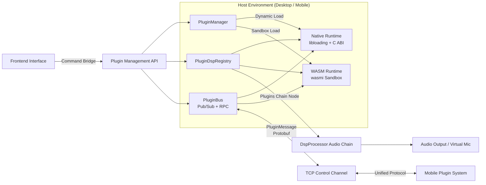
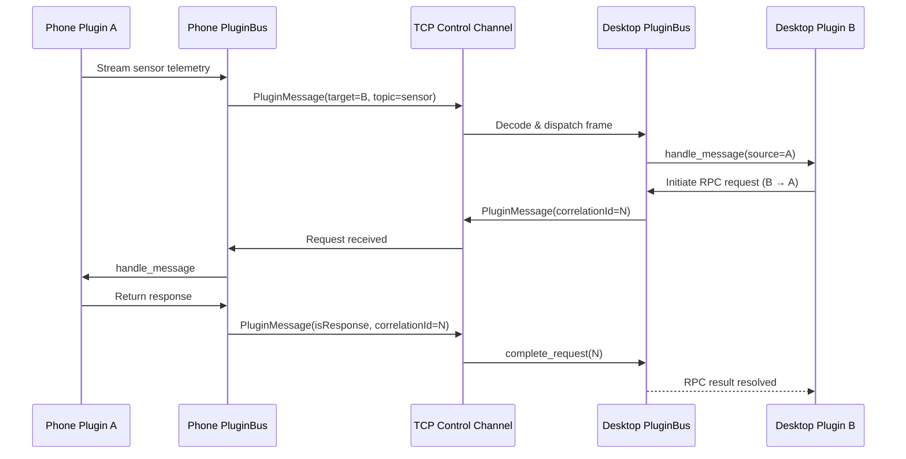

# Plugin System Overview

MicYou features a lightweight yet extensible plugin system that empowers developers to enhance DSP audio capabilities, embed dedicated settings panels, bind global hotkeys, and coordinate real-time cross-device communication between PC and mobile.

## Design Goals

- **Dual Runtime Architecture**: Seamlessly supports high-performance **Native** dynamic libraries (C ABI) and sandboxed **WebAssembly (WASM)** modules under a unified manifest format, capability permission model, and message bus.
- **Audio Pipeline Integration**: Allows DSP plugins to tap directly into real-time audio streams for noise filtering, voice changing, equalization, and custom effects.
- **Unified Cross-Platform Protocol**: Desktop and mobile clients share the same manifest schema, Host API semantics, and Protobuf message contracts.
- **Headless Decoupling**: The plugin engine runs independently of the frontend UI, operating reliably across desktop GUI, headless CLI, and terminal TUI environments.

## System Architecture

## Dual Runtimes Comparison

| Feature | Native Plugin (cdylib) | WebAssembly Plugin (WASM) |
| --- | --- | --- |
| **Output Binary** | `.so` / `.dylib` / `.dll` | `.wasm` bytecode module |
| **Loading Mechanism** | `libloading` + versioned C ABI | `wasmi` interpreter (memory & fuel sandbox) |
| **Performance** | Native speed; supports hardware acceleration & direct OS calls | Interpreted execution; safe & controlled, suitable for logic tasks |
| **System Access** | Full OS access (drivers, ONNX models, raw device APIs) | Isolated sandbox; accesses resources strictly via Host API permissions |
| **Real-time Audio Safety** | Guaranteed by plugin code; declared via `realtimeSafe: true` | Best-effort execution; cannot declare `realtimeSafe` |
| **Typical Use Cases** | Real-time audio DSP, voice changers, compute-heavy algorithms | Automation, settings panels, soundboards, lightweight filtering |
| **Cross-Platform** | Requires separate compilation per target OS | Single `.wasm` binary runs cross-platform |

## DSP Audio Pipeline Integration

- **Dedicated Processing Thread**: Server audio streams execute on an isolated real-time audio thread, chained through `DspProcessor::process`.
- **Processing Order**: The default pipeline contains Acoustic Echo Cancellation (AEC), Noise Suppression, Dereverberation, Equalizer (EQ), Gain Amplifier, Automatic Gain Control (AGC), and Voice Activity Detection (VAD).
- **Composite Plugins Node**: Active DSP plugins are scheduled through the composite **`Plugins`** node, positioned right after AEC by default (customizable in desktop settings).
- **Deterministic Scheduling**: Node execution order is strictly managed by `PluginDspRegistry` (priority flag `first` runs first, followed by deterministic plugin ID ordering).
- **Safe Fallback**: Any unexpected exception or timeout within a plugin node triggers an automatic bypass without interrupting the main audio stream.

## Cross-Device Communication Model

When PC and phone are connected, plugins on both ends communicate seamlessly through a shared message bus:

- **Message Wire Format**: Protobuf `PluginMessage` transported over the control channel.
- **Interaction Patterns**: Supports topic-based Publish/Subscribe, RPC request-response pairing with timeout protection, and broadcasting.
- **Shared Semantics**: Mobile and desktop environments adhere to identical bus semantics.

## Plugin Categories

| Category | Primary Function | Recommended Runtime |
| --- | --- | --- |
| **DSP / Audio Processing** | Injects into the live audio graph to modify audio frames | Native (WASM for light filtering only) |
| **Utility / Automation** | Background workflows, HTTP requests, file logging, notifications | WASM / Native |
| **UI / Panels** | Adds dedicated configuration views or visual controllers | WASM (+ iframe bridge) |
| **Bridge / Sync** | Cross-device sensor capture and telemetry synchronization | WASM / Native |
