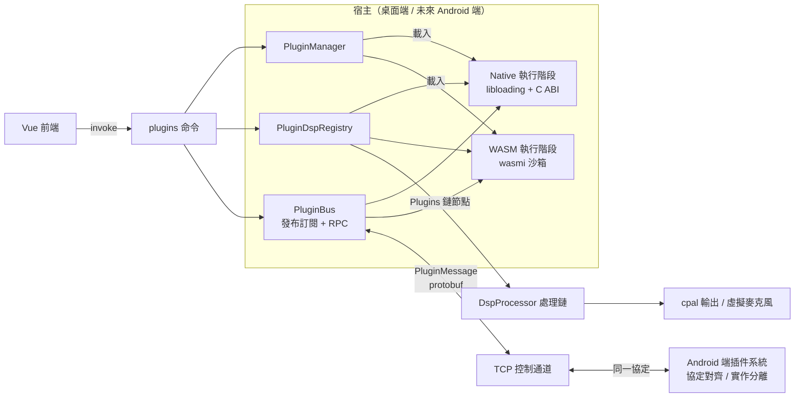
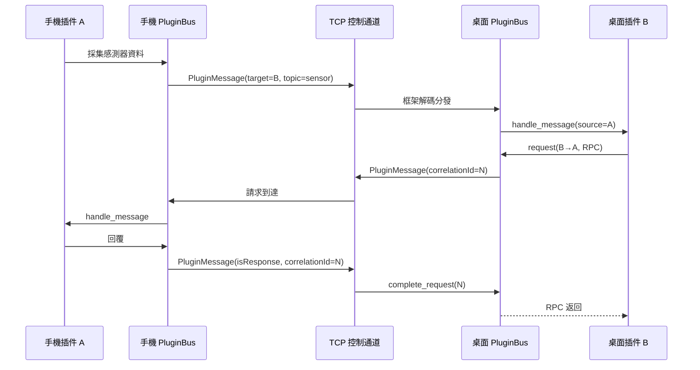

# 插件系統總覽

## 目標

- 雙執行階段：**Native**（cdylib）與 **WASM** 插件，統一抽象、統一資訊清單、統一通訊協定
- 插件可插入 DSP 處理鏈、註冊 UI 面板、訂閱事件、跨端收發訊息
- 桌面端（Tauri）與未來 Android 端共用同一套 Manifest / Host API 能力描述 / 跨端訊息協定，僅載入實作不同
- 最小侵入接入現有 `tauri-app` 架構，三個前端（GUI / CLI / TUI）共用同一伺服器核心

## 架構圖

## 雙執行階段說明

| 維度 | Native（cdylib） | WASM |
| --- | --- | --- |
| 載體 | `.so` / `.dylib` / `.dll` | `.wasm` 模組 |
| 載入方式 | `libloading` + 版本化 C ABI | `wasmi` 純 Rust 直譯器 |
| 效能 | 最高，可直連系統 API | 直譯執行，適合邏輯類 |
| 系統能力 | 全部（驅動、ONNX、音訊裝置） | 無（記憶體沙箱 + 宿主授權） |
| 即時安全 | 由插件保證，宿主依 `realtimeSafe` 宣告信任 | 預設 best-effort，禁止宣告 realtimeSafe |
| 典型用途 | 即時 DSP、虛擬裝置、深度整合 | 邏輯擴充、UI 面板、自動化、輕量處理 |
| 跨平台 | 每個平台獨立構建產物 | 單一產物全平台（含未來 Android） |

## 與 DSP 音訊鏈路的關係

- 伺服器端音訊管線運行在專用音訊執行緒（`crates/micyou-core/src/server/audio_pipeline.rs`），PCM 解碼後經由 `micyou_audio::DspProcessor::process` 進行鏈式處理
- 處理鏈由 `settings.json` 的 `processing_chain` 驅動（預設包含 AEC、降噪、去混響、等化器、放大、AGC、VAD）
- 插件系統透過 `DspProcessor::set_external_hook` 接入音訊鏈，由合成節點 **`Plugins`** 負責調度已啟用的 DSP 插件
- 若存在已啟用的 DSP 插件，預設在 AEC 節點之後執行（使用者可在 GUI 設定中自由調整順序）
- 插件內部節點執行順序由 `PluginDspRegistry` 管理（支援 `first` 標記優先，其餘按插件 ID 確定性排序）
- 單一插件處理異常時僅記錄日誌並自動旁路（Bypass），不阻斷主音訊流水線

## 跨端同步模型

- **訊息格式**：protobuf `PluginMessage`（`proto/network.proto`），掛載在 `MessageWrapper` 欄位 7
- **傳輸**：桌面端透過 TCP 控制通道（`tcp_server`）與手機控制工作階段
- **語意**：發布訂閱（topic）+ 請求回應（correlationId）+ 廣播（空 target）
- **Android 端**：複用同一協定與匯流排語意，僅替換傳輸實作與插件載入實作

## 插件分類

| 分類 | 說明 | 推薦執行階段 |
| --- | --- | --- |
| DSP / Realtime Processor | 即時音訊處理節點 | Native（WASM 受限，best-effort） |
| Utility / Service | 背景邏輯、自動化、網路、檔案 | WASM / Native |
| UI / Panel | 前端設定面板或視覺化組件 | WASM（+ Vue 註冊） |
| Bridge / Sync | 跨端狀態同步 | Native / WASM |
