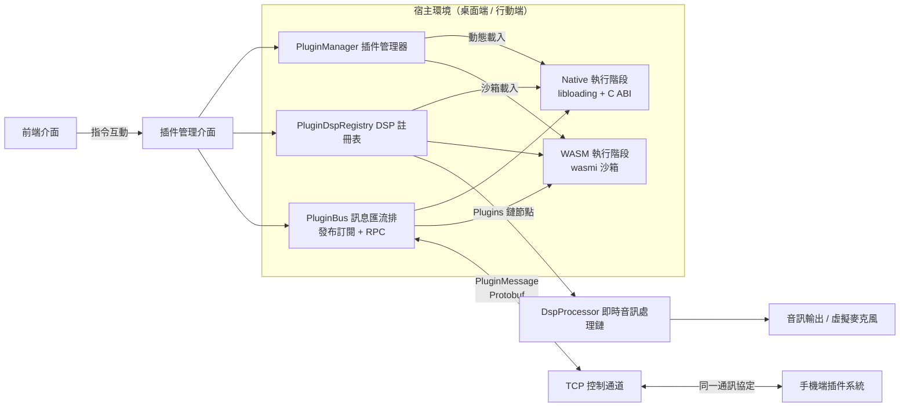
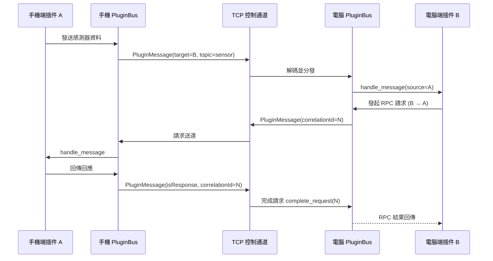

# 插件系統總覽

MicYou 提供了輕量且強大的插件系統，允許開發者擴充音訊處理能力（DSP 節點）、註冊專屬設定面板、綁定全域快捷鍵，以及在電腦與手機之間同步資料。

## 核心設計目標

- **雙執行階段架構**：支援高效能 **Native**（C ABI 動態程式庫）與安全隔離的 **WebAssembly (WASM)** 插件，兩套執行階段採用統一的清單描述、權限模型與通訊協定。
- **音訊鏈深度接入**：DSP 插件可無縫插入即時音訊處理管線，進行降噪、變聲、等化、音效增強等處理。
- **端到端協定對齊**：桌面端（Tauri）與行動端共用同一套 Manifest 格式、Host API 語意及 Protobuf 跨端訊息匯流排。
- **無前端依賴與跨端解耦**：插件引擎獨立於 UI 介面運作，在 GUI 桌面端、無前端 CLI 及終端機 TUI 模式下均可穩定工作。

## 系統架構

## 雙執行階段對比

| 特性 | Native 插件（cdylib） | WebAssembly 插件（WASM） |
| --- | --- | --- |
| **檔案產物** | `.so` / `.dylib` / `.dll` | `.wasm` 位元組碼模組 |
| **載入機制** | `libloading` + 版本化 C ABI | `wasmi` 直譯器（記憶體與指令沙箱） |
| **執行效能** | 原生最高效能，支援硬體加速與系統呼叫 | 直譯執行，安全受控，適合常規邏輯與輔助處理 |
| **系統權限** | 完整系統權限（底層驅動、ONNX 模型、硬體存取） | 受限沙箱環境，僅能透過宿主授權的 Host API 操作 |
| **即時音訊安全** | 由插件程式碼保證，需在清單宣告 `realtimeSafe: true` | 預設盡力而為（Best-effort），禁止宣告 `realtimeSafe` |
| **典型應用場景** | 即時音訊 DSP、高算力演算法、深度硬體整合 | 邏輯擴充、設定面板、自動化任務、音效板、輕量過濾 |
| **跨平台支援** | 需針對各作業系統分別編譯產物 | 單一 `.wasm` 檔案即可跨全平台通用 |

## DSP 音訊鏈路接入機制

- **音訊處理執行緒**：伺服器端的 PCM 音訊流在獨立的即時音訊執行緒中運作，經由 `DspProcessor::process` 鏈式處理。
- **處理節點編排**：預設處理鏈路包含回聲消除 (AEC)、降噪、去混響、等化器 (EQ)、增益放大、自動增益 (AGC) 與語音偵測 (VAD)。
- **插件節點排程**：已啟用的 DSP 插件由合成節點 **`Plugins`** 統一排程，預設置於 AEC 節點之後執行（使用者可在桌面設定中調整先後順序）。
- **執行順序保障**：插件節點的執行順序由 `PluginDspRegistry` 確定性管理（優先執行宣告了 `first` 的節點，其餘按插件 ID 排序）。
- **異常安全隔離**：單個插件若在處理音訊時發生異常或逾時，宿主會自動將其旁路（Bypass），確保主音訊流不中斷、不崩潰。

## 跨端通訊模型

電腦與手機建立連線後，兩端的插件可以透過統一的訊息匯流排互相通訊：

- **訊息載體**：Protobuf 定義的 `PluginMessage`，掛載於底層控制通道。
- **通訊模式**：支援主題發布訂閱（Publish/Subscribe）、請求回應（RPC）及全網廣播。
- **協定共用**：手機端與電腦端遵循相同的匯流排協定與訊息結構。

## 插件分類

| 分類 | 核心功能 | 推薦執行階段 |
| --- | --- | --- |
| **DSP / 即時音訊處理** | 插入音訊流水線，即時修改音訊樣本 | Native（WASM 僅限輕量處理） |
| **Utility / 輔助工具** | 背景自動化、網路請求、檔案記錄、系統通知 | WASM / Native |
| **UI / 面板組件** | 註冊專屬設定頁或互動式控制介面 | WASM（+ iframe 橋接） |
| **Bridge / 跨端橋接** | 手機感測器資料採集、裝置狀態雙向同步 | WASM / Native |
